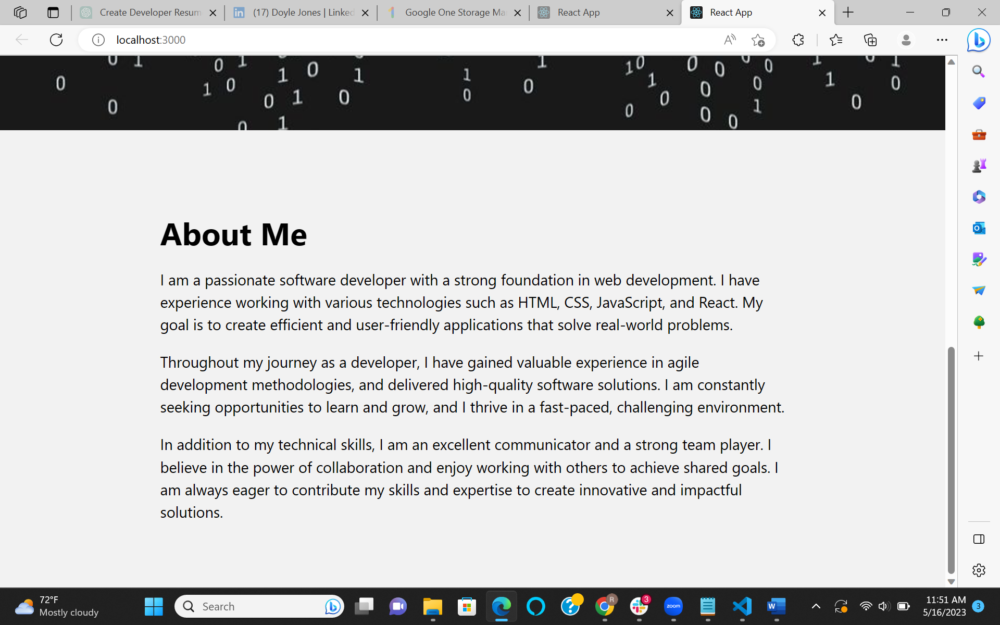
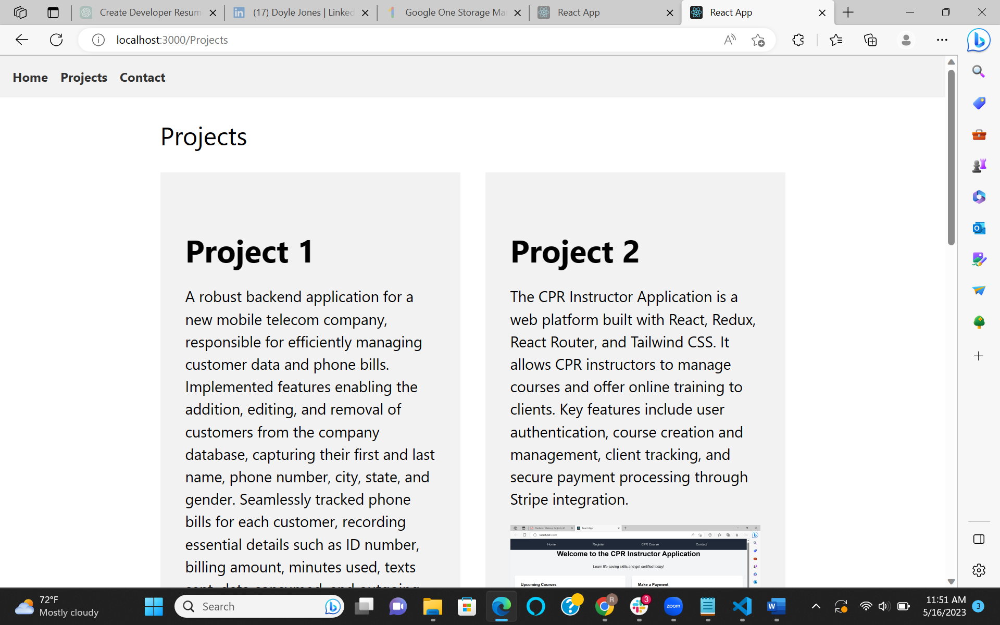
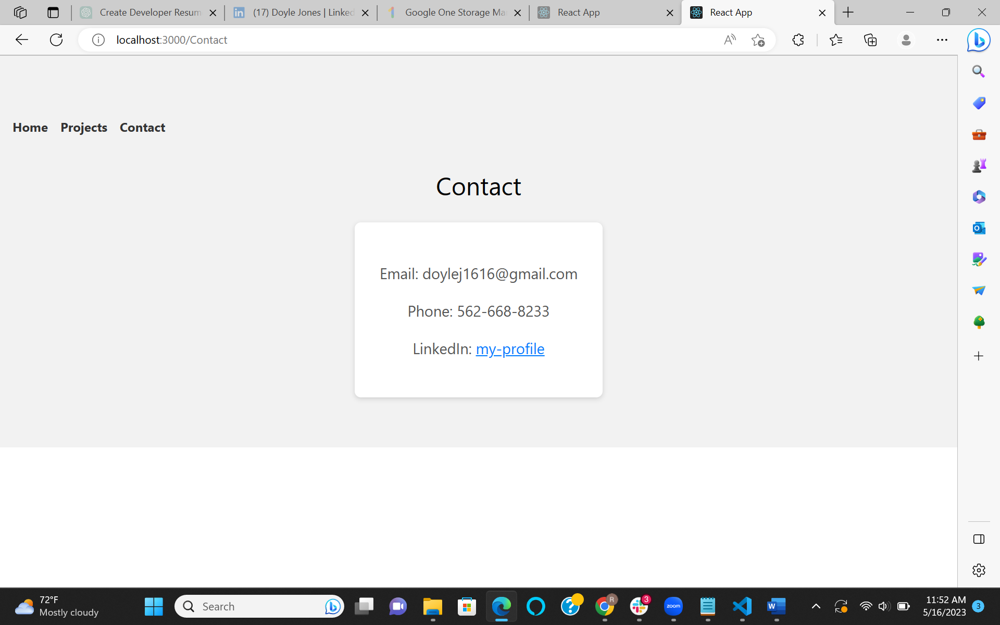

# Portfolio

## User Story
As a new software developer, it is important to showcase my experience and projects so far. While attending DigitalCrafts, I have gained the knowledge and expertise to be a full-stack developer. I will be graduating soon, and I am excited to take the next step in my career.

## Project Description
This project is built using a combination of React, react-router-dom, and my own CSS. This application has 3 tabs: one to display general information about myself, one for my projects, and another for contact purposes. It is a portfolio application displaying a good portion of my skills and general knowledge.

## Installation
1. Clone this repository: [Portfolio](https://github.com/Doylej16/Portfolio)
2. Run `npm install` to install the dependencies.
3. Cd portfolio2
4. Run `npm start` to start the application.

## Screenshots

## License
MIT
